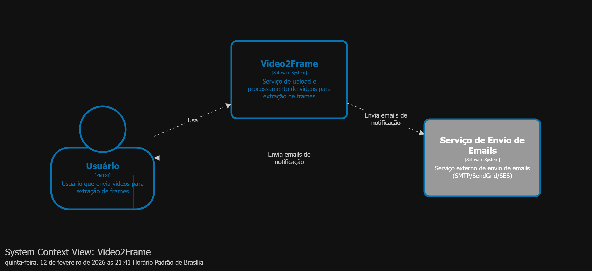
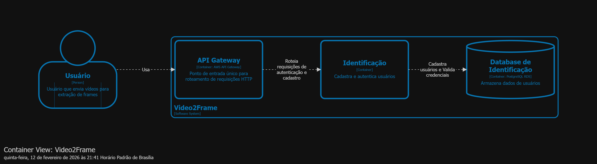
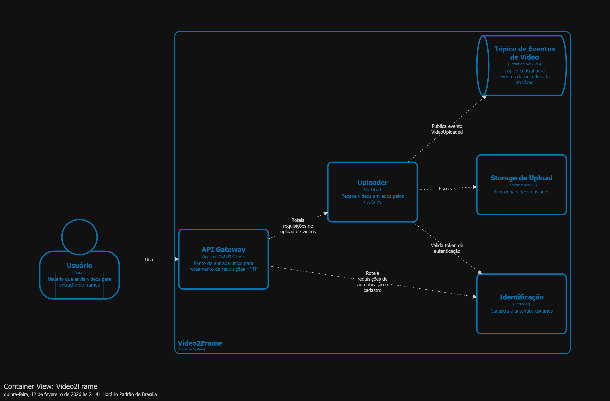
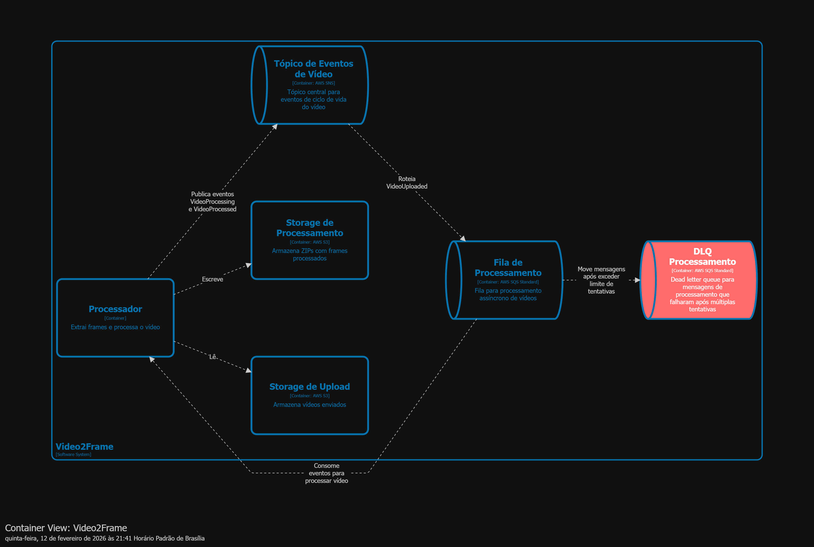
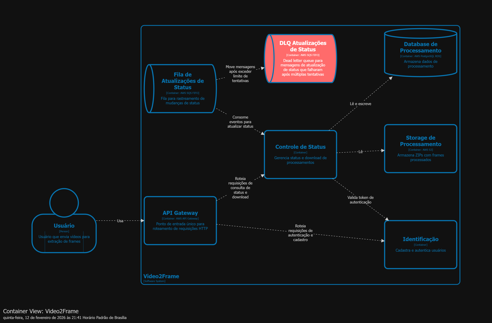
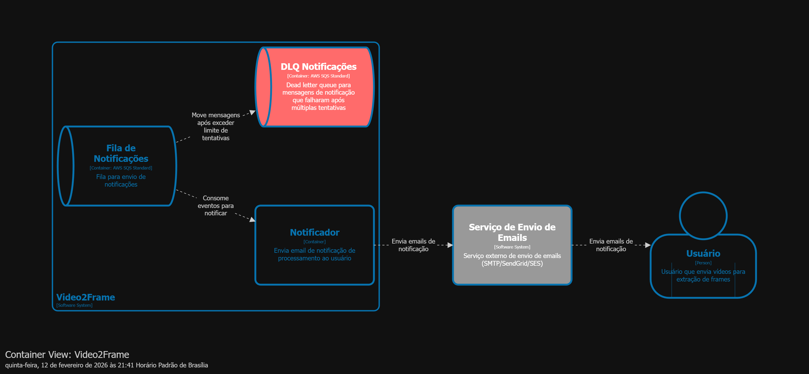
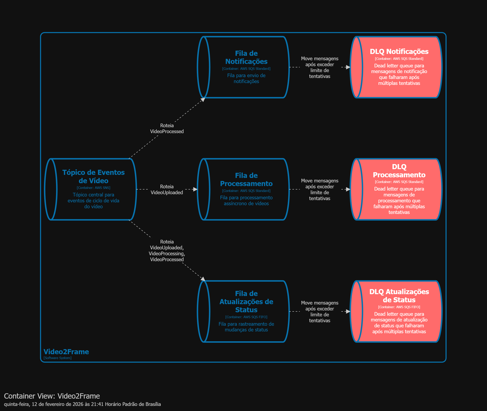
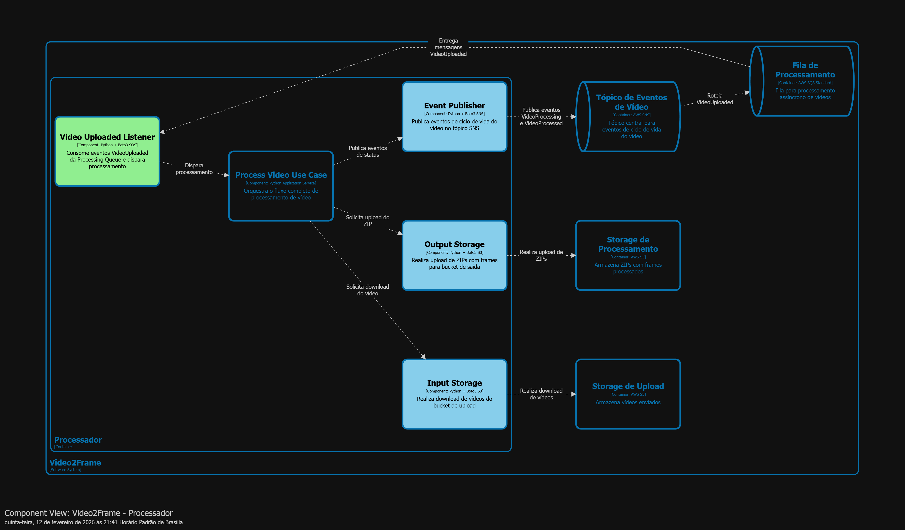
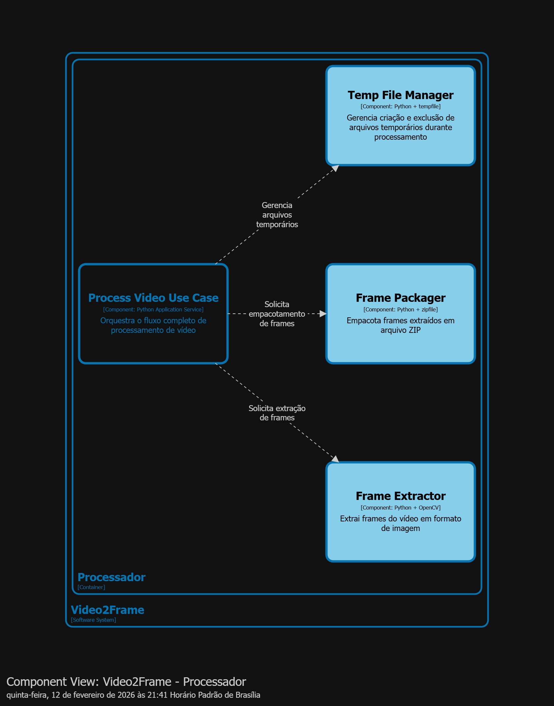
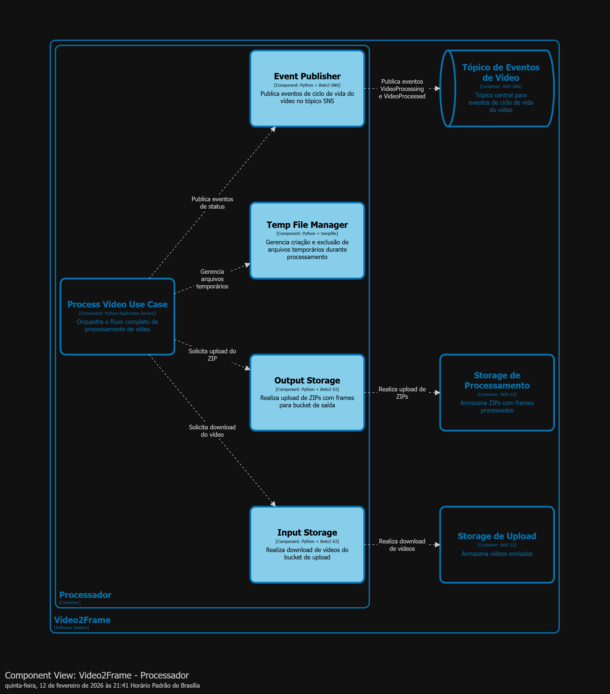

# Infraestrutura Video2Frames - Hackathon FIAP

## Introdução

Este repositório contém a infraestrutura como código (IaC) utilizando Terraform para provisionar os recursos necessários na AWS para o projeto Video2Frames, desenvolvido como parte do Hackathon da Pós-Graduação em Arquitetura de Software da FIAP. A solução provisiona uma arquitetura completa incluindo cluster Kubernetes (EKS), banco de dados PostgreSQL (RDS), buckets S3 para armazenamento de vídeos e frames extraídos, API Gateway para exposição de serviços, filas SQS e tópicos SNS para processamento assíncrono, além de uma função Lambda para inicialização do banco de dados, tudo integrado em uma VPC dedicada com subnets públicas e privadas.

## C4 Model

### Contexto

### Container

### Componentes

#### Video Processor

