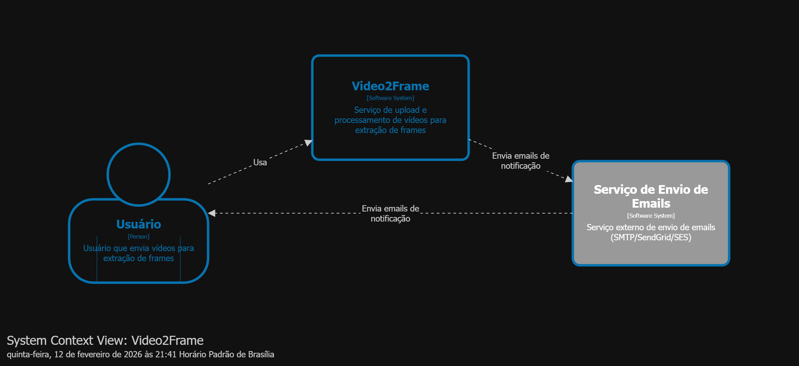
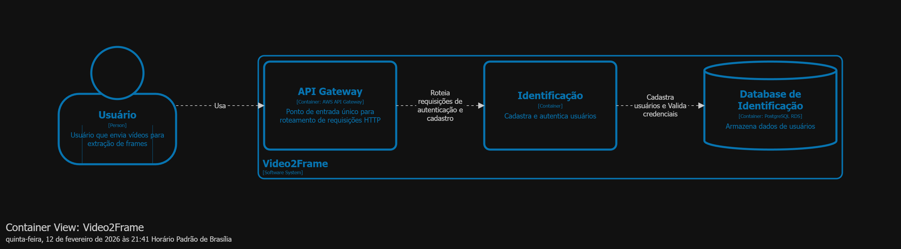
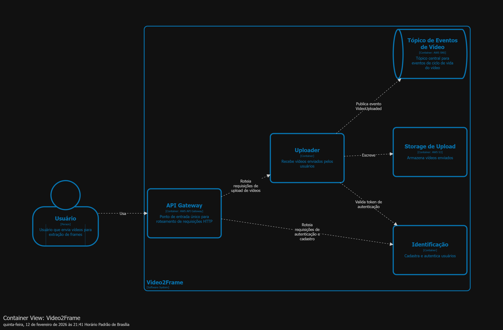
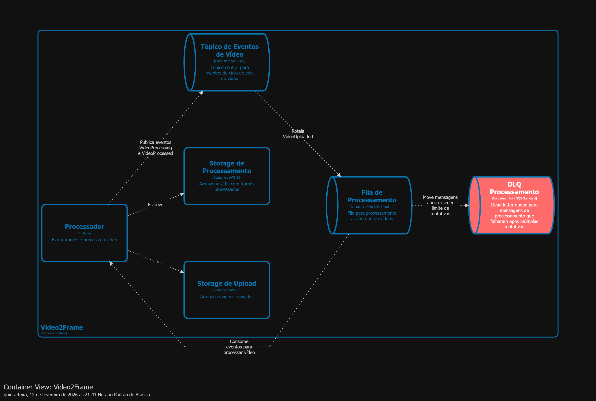
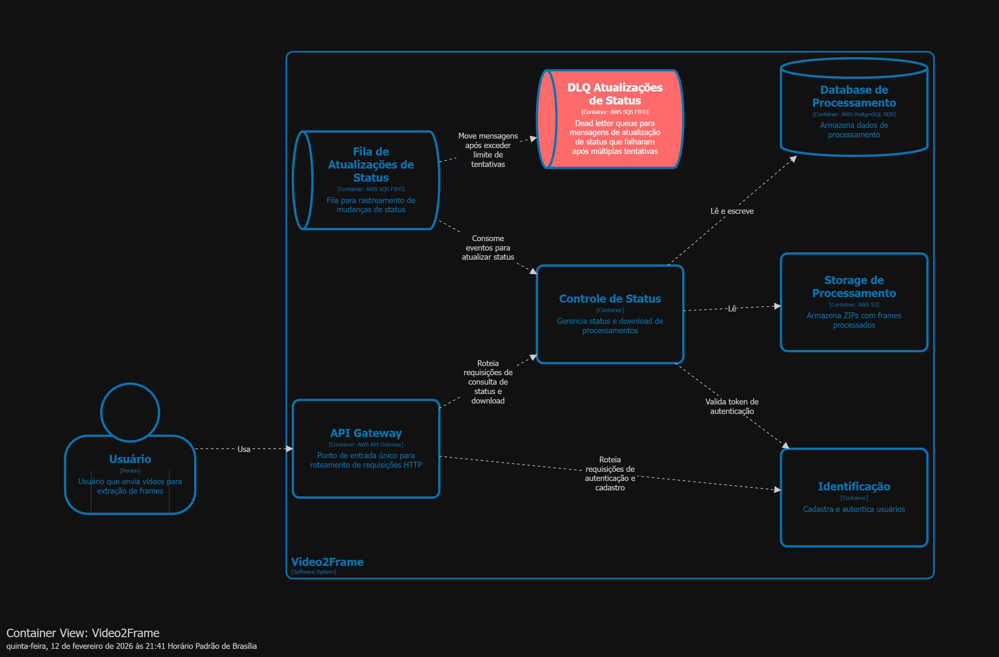
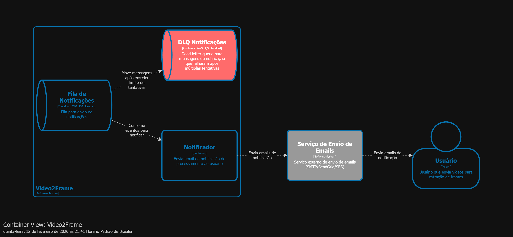
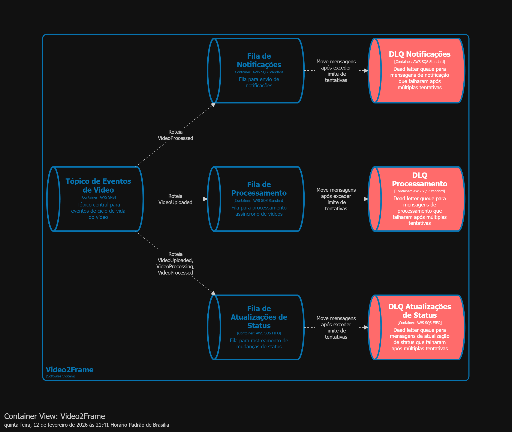
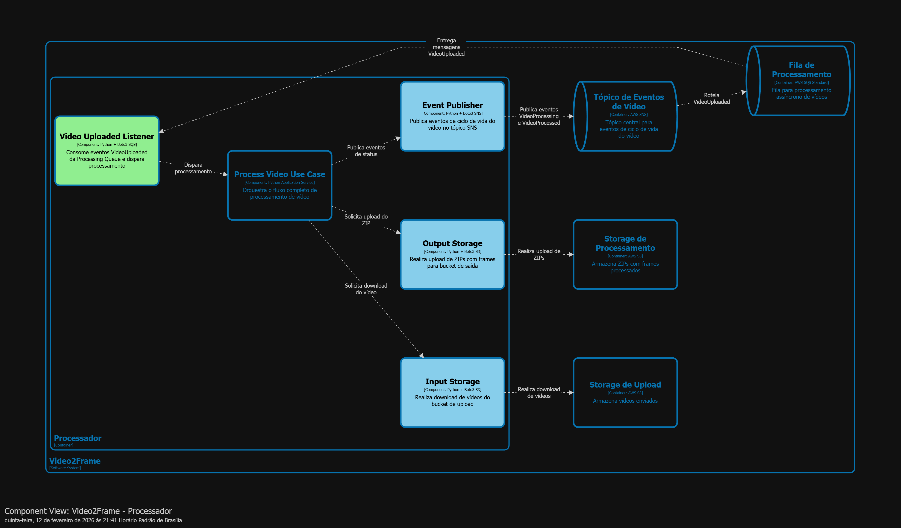
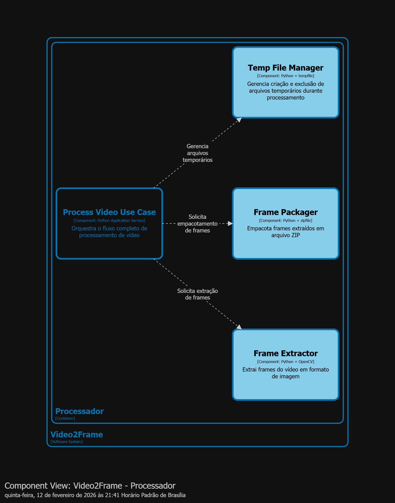
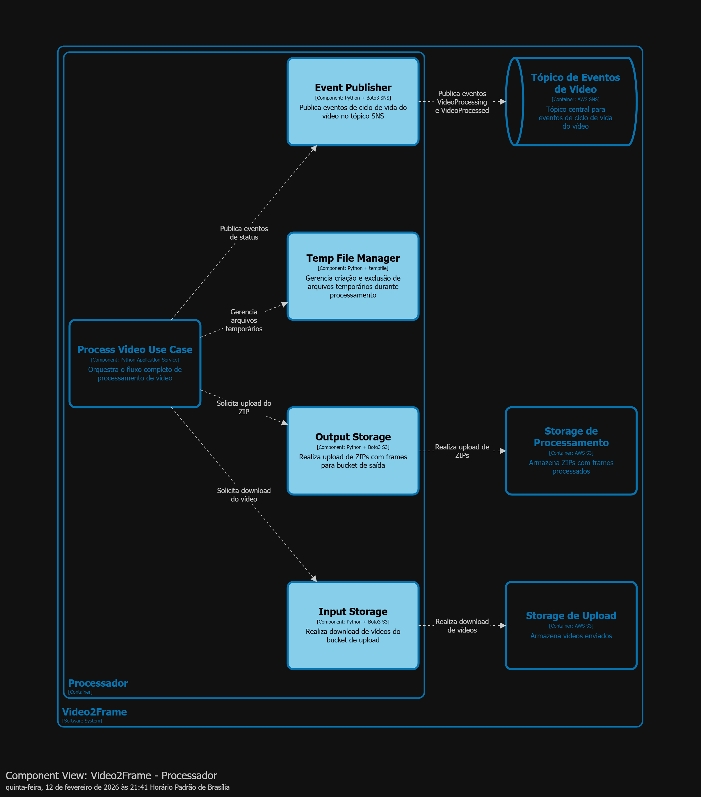

# Video2Frames - Hackathon FIAP

## Sobre o Projeto

**Video2Frames** é uma solução completa de processamento de vídeos desenvolvida como entrega para o Hackathon da Pós-Graduação em Arquitetura de Software da FIAP. O sistema permite que usuários façam upload de vídeos para extrair frames e baixá-los em formato ZIP, implementando os conceitos de arquitetura de software, microsserviços, qualidade de código, mensageria assíncrona e escalabilidade.

## Repositórios do Projeto

A solução é composta por uma arquitetura de microsserviços distribuída em múltiplos repositórios:

| Repositório | Descrição | Tecnologia |
|---|---|---|
| [infrastructure](https://github.com/Video2Frames/infrastructure) | IaC com Terraform, documentação arquitetural e scripts de banco de dados | Terraform, AWS |
| [lambda-identification-auth](https://github.com/Video2Frames/lambda-identification-auth) | API de autenticação e cadastro de usuários | AWS Lambda, Java |
| [video-workflow](https://github.com/Video2Frames/video-workflow) | Gerencia endpoints de upload, status, download e notificações | Kubernetes, Java |
| [video-processor](https://github.com/Video2Frames/video-processor) | Processa vídeos, extrai frames, empacota e faz upload dos ZIPs | Kubernetes, Python |
| [monitoring](https://github.com/Video2Frames/monitoring) | Stack de observabilidade com Prometheus e Grafana | Kubernetes, Prometheus, Grafana |

## Infraestrutura

Este repositório contém a **Infraestrutura como Código (IaC)** utilizando Terraform para provisionar os recursos necessários na AWS. A solução provisiona uma arquitetura completa incluindo:

- **Cluster Kubernetes (EKS)** para orquestração de containers
- **Banco de Dados PostgreSQL (RDS)** separados para autenticação e processamento
- **Buckets S3** para armazenamento de vídeos enviados e frames processados
- **API Gateway** como ponto de entrada único
- **Tópico SNS único** (video-events.fifo) e **Filas SQS** para processamento assíncrono baseado em eventos
- **Lambda** para inicialização de bancos de dados
- **VPC dedicada** com subnets públicas e privadas

## Princípios Arquiteturais

### Arquitetura Hexagonal

Aplicamos os princípios de **Arquitetura Hexagonal** em todos os microsserviços, permitindo isolamento da lógica de negócio das dependências externas (bancos de dados, filas de mensagem, etc.). Isso facilita testabilidade, manutenção e evolução do código.

### Coreografia de Eventos

Os microsserviços interagem através de **coreografia de eventos**, onde cada serviço é responsável por:
- **Consumir** mensagens relevantes de filas SQS
- **Processar** a lógica de negócio
- **Publicar** eventos no **tópico SNS único** (video-events.fifo)

O sistema utiliza um **único tópico SNS** central para todos os eventos do ciclo de vida do vídeo. As mensagens são diferenciadas através do campo `event_type`, permitindo que as filas SQS subscritas apliquem filtros e consumam apenas os eventos relevantes para cada microsserviço. Desta forma, o sistema funciona de maneira desacoplada e altamente escalável, sem necessidade de orquestração central.

## Documentação da Arquitetura - C4 Model

A arquitetura do projeto foi documentada utilizando o **C4 Model** (Contexto, Container, Componentes e Código), permitindo uma visualização clara e escalável dos diferentes níveis de abstração do sistema. Os diagramas foram gerados através da ferramenta [Structurizer](https://structurizer.dev/), utilizando a linguagem **Structurizr DSL**. O código-fonte completo da modelagem está disponível em [docs/c4/workspace.dsl](docs/c4/workspace.dsl).

### Contexto



### Container








### Componentes

#### Video Processor






## Contratos de Mensagens

O sistema utiliza mensagens assíncronas para garantir desacoplamento entre os microsserviços. Todas as mensagens são publicadas em um **único tópico SNS** chamado `video-events.fifo` (Tópico de Eventos de Vídeo) e consumidas através de filas SQS que se subscrevem a este tópico.

Cada mensagem possui um **MessageAttribute** chamado `event_type` que identifica o tipo de evento, permitindo que as filas SQS apliquem filtros e recebam apenas os eventos relevantes. O `event_type` não faz parte do payload JSON, sendo um atributo da mensagem SNS. Abaixo estão os contratos dos tipos de eventos suportados:

### Event Type: `video.uploaded`

Publicado quando um vídeo é enviado com sucesso para o S3.

**MessageAttribute:** `event_type = "video.uploaded"`

**Payload:**
```json
{
    "video_id": "27fd0ac4-d05e-493b-9c47-53407280caff",
    "user_id": "d2c18f00-4bfe-439d-8b9e-ba9426e392bf",
    "upload_path": "27fd0ac4-d05e-493b-9c47-53407280caff.mp4",
    "uploaded_at": "2026-02-06T00:17:50.673987+00:00"
}
```

**Consumidores:**
- Video Processor (via `processing_queue`)
- Status Service (via `status_updates_queue`)

### Event Type: `video.processing_started`

Publicado quando o processamento de um vídeo é iniciado.

**MessageAttribute:** `event_type = "video.processing_started"`

**Payload:**
```json
{
    "video_id": "27fd0ac4-d05e-493b-9c47-53407280caff",
    "processing_started_at": "2026-02-06T00:17:50.673987+00:00"
}
```

**Consumidores:**
- Status Service (via `status_updates_queue`)

### Event Type: `video.processed`

Publicado quando o processamento de um vídeo é completado com sucesso.

**MessageAttribute:** `event_type = "video.processed"`

**Payload:**
```json
{
    "video_id": "27fd0ac4-d05e-493b-9c47-53407280caff",
    "output_path": "27fd0ac4-d05e-493b-9c47-53407280caff.mp4",
    "processed_at": "2026-02-06T00:17:50.673987+00:00"
}
```

**Consumidores:**
- Status Service (via `status_updates_queue`)
- Notificator Service (via `notifications_queue`)

### Event Type: `video.processing_failed`

Publicado quando ocorre falha no processamento de um vídeo.

**MessageAttribute:** `event_type = "video.processing_failed"`

**Payload:**
```json
{
    "video_id": "27fd0ac4-d05e-493b-9c47-53407280caff",
    "error_message": "Falha ao processar o vídeo",
    "failed_at": "2026-02-06T00:17:50.673987+00:00"
}
```

**Consumidores:**
- Status Service (via `status_updates_queue`)
- Notificator Service (via `notifications_queue`)

Para mais detalhes sobre os contratos de mensagens, consulte [messaging.md](messaging.md).

## Documentação de Endpoints
